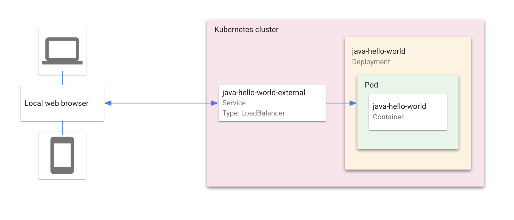
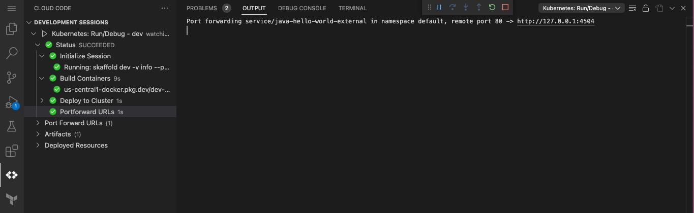

# GitOps CI/CD Pipeline with Cloud Build, Cloud Deploy, and Skaffold

"Hello World" is a Kubernetes application that contains a single
[Deployment](https://kubernetes.io/docs/concepts/workloads/controllers/deployment/) and a corresponding
[Service](https://kubernetes.io/docs/concepts/services-networking/service/). The Deployment contains a web server that renders a simple webpage.

The CI/CD pipeline uses GitOps to trigger a build when a change is pushed to the main branch. Cloud Build will be triggered to build the Hello World application OCI Image via Skaffold build then create a release for this build in Cloud Deploy. The release will automatically deploy the release to the staging GKE cluster. 

The Cloud Build trigger and Cloud Deploy pipeline build/deploy from a centralized CI/CD GCP project to GKE clusters in staging and production projects with separation of service accounts for each environment/cloud deploy runners.   

### Table of Contents
* [What's in this demo](#whats-in-this-demo)

---
## What's in this demo
### Kubernetes Architecture

### CI/CD Pipeline Architecture

### Directory contents

- `skaffold.yaml` - A schema file that defines skaffold configurations to build container image, render manifests, and deploy to staging and production profiles. This file is the main config used by Cloud Deploy. Leverages Cloud Build private pool for Render and Deploy operations. ([skaffold.yaml reference](https://skaffold.dev/docs/references/yaml/))
- `deploy-target-staging.yaml` - staging GKE cluster target definition file used by Cloud Deploy.
- `deploy-target-prod.yaml` - prod GKE cluster target definition file used by Cloud Deploy.
- `delivery-pipeline.yaml` - Cloud Deploy pipeline definition file. Defines which Skaffold profiles are used to deploy to which Cloud Deploy Target and in which sequenial order should targets be deployed to.
- `cloudbuild.yaml` - Cloud Build Configuration file which defines execution steps for building OCI image for Hello World application using Skaffold and creating Cloud Deploy Release using the build artifacts rendered from build (manifest.yaml containing image reference in Artifact Registry).

---

#### Run the app on minikube
1. Select **Develop on Kubernetes** from the configuration dropdown and click the run icon. Cloud Code runs your app in a local [minikube](ttps://minikube.sigs.k8s.io/docs/start/) cluster.  

2. View the build process in the output window. When the deployment is successful, you're notified that new service URLs are available. Click the Service URLs tab to view the URL(s), then click the URL link to open your browser with your running application.  

3. To stop the application, click the stop icon next to the configuration dropdown.

---
