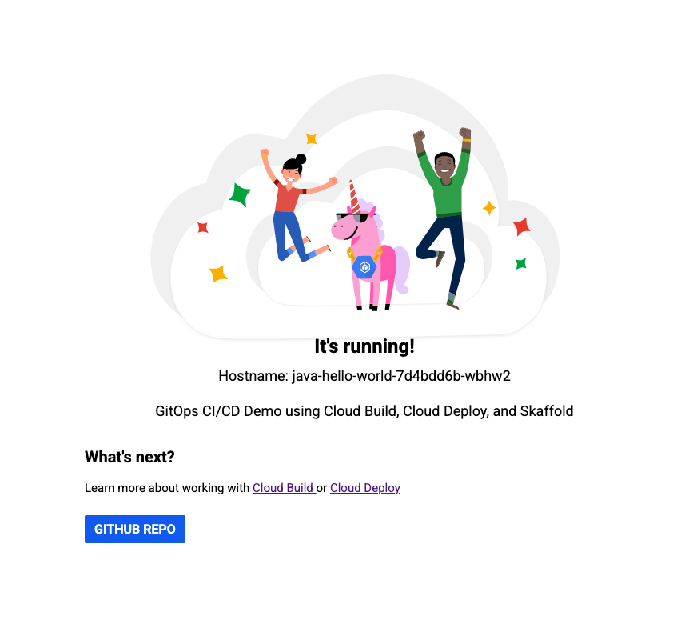
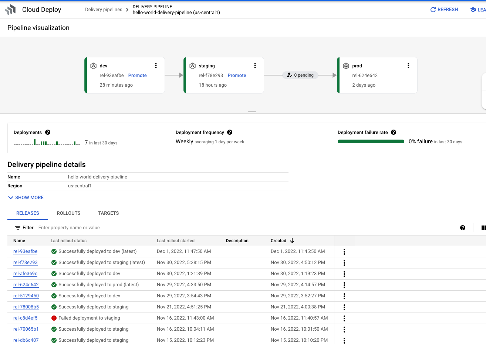

# End to End GCP CI/CD Pipeline: from Local Development in Cloud Code/Minikube to Running App in Production GKE Cluster

This codebase represents an end to end GCP CI/CD pipeline for development and deployment of a microservices based application using the following services:
* Cloud Code and minikube - for local development and testing
* Skaffold - for building image(s), rendering kubernetes manifests, and deploying manifests
* Cloud Build - for building remote images and creating Cloud Deploy Releases
* Cloud Deploy - for continuous delivery of applicaiton to remote GKE clusters

### Table of Contents
* [Prerequesites](#prerequesites)
* [Kubernetes Architecture](#kubernetes-architecture)
* [CI/CD Pipeline Architecture](#cicd-pipeline-architecture)
* [Directory Contents](#directory-contents)
* [Develop the application](#develop-the-application)
  * [Deploy to minikube](#local-development-on-minikube)
  * [Trigger remote CI/CD Pipeline](#trigger-remote-cicd-pipeline)

---
### Prerequesites
This demo assumes you have alreade set up the required CI/CD, Dev, Staging, and Production GCP projects, the Cloud Build Trigger, Cloud Deploy pipeline and targets (yaml files shared in this repo), GKE clusters, Artifact Registry, and necessary service accounts for cross project authentication of Cloud Build/Cloud Deploy to GKE clusters and GKE clusters to Artifact Registry. You can use the following [git repo](https://github.com/jlaude/terraform-infra) as a reference for containing the terraform modules to create the base infrastructure.

### CI/CD Pipeline Architecture

### Directory contents

- `./skaffold.yaml` - A schema file that defines skaffold configurations to build container image, render manifests, and deploy to staging and production profiles. This file is the main config used by Cloud Deploy. Leverages Cloud Build private pool for Render and Deploy operations. ([skaffold.yaml reference](https://skaffold.dev/docs/references/yaml/))
- `./cloud-deploy-configs/deploy-target-staging.yaml` - staging GKE cluster target definition file used by Cloud Deploy.
- `./cloud-deploy-configs/deploy-target-prod.yaml` - prod GKE cluster target definition file used by Cloud Deploy.
- `./cloud-deploy-configs/delivery-pipeline.yaml` - Cloud Deploy pipeline definition file. Defines which Skaffold profiles are used to deploy to which Cloud Deploy Target and in which sequenial order should targets be deployed to.
- `./cloudbuild.yaml` - Cloud Build Configuration file which defines execution steps for building OCI image for Hello World application using Skaffold and creating Cloud Deploy Release using the build artifacts rendered from build (manifest.yaml containing image reference in Artifact Registry).
- `./src/webservice` - source code for web tier service
- `./src/applicaitontier` - source code for application tier service
- `./base` - kustomize base manifest files
- `./overlays` - kustomize overlays for environments

---

## Develop the Application

### Local Development on Minikube
1. Select **Develop on Kubernetes** from the configuration dropdown and click the run icon. Cloud Code runs your app in a local [minikube](ttps://minikube.sigs.k8s.io/docs/start/) cluster. As you make changes to your source code, you will first deploy the image(s) to your local minikube cluster before pushing the changes to the remote branch, triggering the remote CI/CD pipeline to build/push the image to Artifact Registry, and create a Cloud Deploy Release. 

2. View the build process in the output window. When the deployment is successful, you're notified that new service URLs are available. Click the Service URLs tab to view the URL(s), then click the URL link to open your browser with your running application.  

 

### Trigger Remote CI/CD Pipeline

1. Once you are happy with your changes locally, commit and push changes to the remote branch. This triggers Cloud Build. The two steps in cloud build are: 1.) build the image using Skaffold configuration 2.) create a Cloud Deploy Release. The Cloud Deploy Release will render manifests for each environment and deploy the application to the dev environment cluster.
2. Upon successful deployment, promote the release through the staging and production environments.

---
